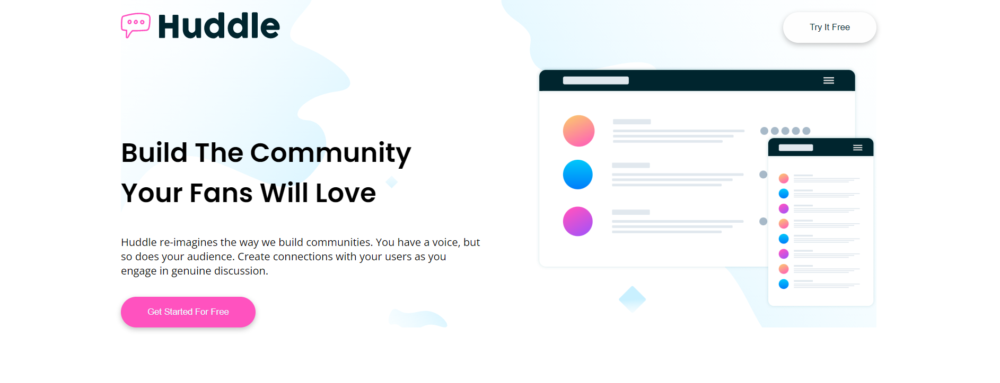
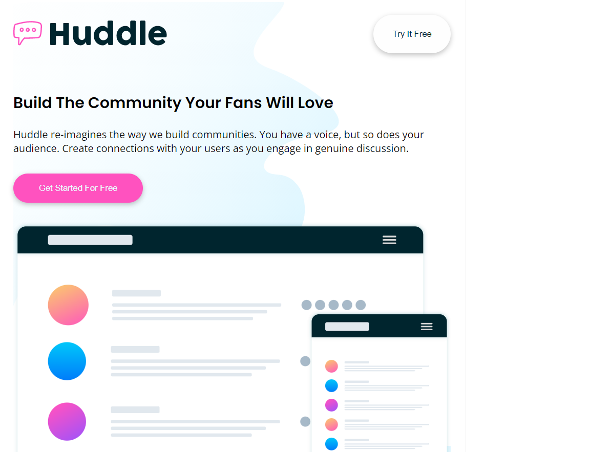

# Huddle-landing-page-with-alternating-feature-blocks
Solution for Huddle landing page with alternating feature blocks Frontend Mentor Junior HTML And  CSS Challenge

## Table of contents

- [Overview](#overview)
  - [The challenge](#the-challenge)
  - [Screenshot](#screenshot)
  - [Links](#links)
- [My process](#my-process)
  - [Built with](#built-with)
  - [What I learned](#what-i-learned)
  - [Continued development](#continued-development)
  - [Useful resources](#useful-resources)
- [Author](#author)


## Overview

### The challenge

Users should be able to:

- See hover states for interactive elements.
- View the optimal layout with All Screens sizes (Responsive Design).

### Screenshot





### Links

- Live Site URL: [Huddle landing page with alternating feature blocks](https://abdallahsalah003.github.io/Huddle-landing-page-with-alternating-feature-blocks/)

## My process

### Built with
ONLY WITH
- Semantic HTML5 markup
- CSS custom properties

### What I learned
Making a Fully Responsive Design With Flex And media.
```
    CSS
    @media (min-width: 768px) {
        .container {
        width: 750px;
        }
    }
    @media (min-width: 992px) {
        .container {
        width: 970px;
        }
    }
    @media (min-width: 1200px) {
        .container {
        width: 1170px;
        }
    }
    .float-card {
        max-width: fit-content;
        display: flex;
        flex-direction: column;
        align-items: center;
        padding: 30px;
        background-color: var(--neutral1);
        border-radius: 10px;
        box-shadow: rgba(100, 100, 111, 0.2) 0px 7px 29px 0px;
        position: absolute;
        bottom: -28%;
    }
```

### Continued development
Why Not!
### Useful resources
- [w3schools](https://www.w3schools.com/howto/howto_css_image_overlay_title.asp)
- [MDN Web Docs](https://developer.mozilla.org/en-US/)

## Author

- Website - working on it
- [@AbdallahSalah003]
